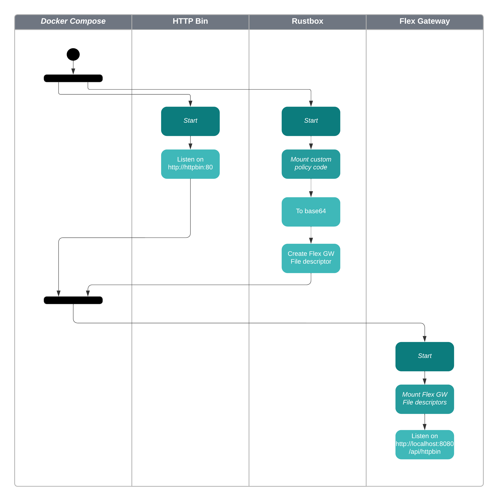

# Flex Gateway - Custom Policies Development Template

This repository contains a template to create a complete Custom Policy ready to be deployed on Flex Gateway.

This template contains a Docker image to spin up a local Flex Gateway that deploys the Custom Policy.

## Features

- **Remove Rust dependencies**: The custom policy code build and packaging is delegated to a Docker container with the required dependencies
- **Generate code from template**: The custom script provided create a custom policy project, ready to published on Exchange
- **Run locally**: A Docker Compose configuration packages the policy, initializes a local Flex Gateway, and deploys the policy
- **Register automatically**: The Docker image provided registers the Flex Gateway against the Anypoint Platform in Local mode when is created. It removes the manual Registration step from the Flex Gateway setup
- **PoC ready**: The provided Flex Gateway Docker image contains an API instance. The Docker compose environment spins up an HTTP Bin server to simplify testing the custom policy with a real API

### Benefits

- Reduces time to value
- Non-Rust developers are able to create and test basic custom policies
- Enables developers to try the code immediately

***Note**: No debug or unit testing capabilities are provided for Flex GW custom policies. Reducing the time required to test the code is a key factor.*

## Prerequisites

- Docker and Docker Compose
- Python 3 and Pip
- Jinja2 Python Library: Install through Pip

## How To Start

- Clone the Git repository
- Install the Python Jinja2 library
```
$ python3 -m pip install --user jinja2
```
- Update the *template-input.json* file
```
{
    "orgId": "COMPLETE",
    "envId": "COMPLETE",
    "clientId": "COMPLETE",
    "clientSecret": "COMPLETE",
    "policyName": "test-policy",
    "descriptivePolicyName": "Test Policy"
}
```
<sub>Anypoint Platform organization, environment, and client credentials are required to connect the Flex Gateway to the platform, even in Local mode. Policy name is replaced everywhere in the custom policy source code</sub>
- In the terminal, run the *create-project.py* script
```
$ python3 create-project.py
```
- Review the files created under the *project* folder
- Under the *project* folder, run Docker Compose
```
$ cd project
$ docker-compose up --force-recreate
```
- When Docker compose starts, verify that the custom policy has been compilation run successfully in the *rustbox* image
```
Recreating project_rustbox_1 ... done
Recreating project_httpbin_1 ... done
Recreating project_flex-gateway_1 ... done
Attaching to project_rustbox_1, project_httpbin_1, project_flex-gateway_1
httpbin_1       | [2023-08-14 19:03:59 +0000] [1] [INFO] Starting gunicorn 19.9.0
rustbox_1       |    Compiling test_policy v0.1.1 (/usr/src/myapp)
rustbox_1       |     Finished release [optimized] target(s) in 0.99s
httpbin_1       | [2023-08-14 19:03:59 +0000] [1] [INFO] Listening at: http://0.0.0.0:80 (1)
httpbin_1       | [2023-08-14 19:03:59 +0000] [1] [INFO] Using worker: gevent
httpbin_1       | [2023-08-14 19:03:59 +0000] [9] [INFO] Booting worker with pid: 9
project_rustbox_1 exited with code 0
```
- Once the httpbin and flex-gateway containers started, on a different terminal, call the API Instance deployed to the Flex GW
```
$ curl http://localhost:8080/api/httpbin/anything -v
*   Trying 127.0.0.1:8080...
* Connected to localhost (127.0.0.1) port 8080 (#0)
> GET /api/httpbin/anything HTTP/1.1
> Host: localhost:8080
> User-Agent: curl/8.1.2
> Accept: */*
>
< HTTP/1.1 200 OK
< server: Anypoint Flex Gateway
< date: Fri, 11 Aug 2023 20:08:11 GMT
< content-type: application/json
< content-length: 398
< access-control-allow-origin: *
< access-control-allow-credentials: true
< x-envoy-upstream-service-time: 4
<
{
  "args": {},
  "data": "",
  "files": {},
  "form": {},
  "headers": {
    "Accept": "*/*",
    "Aheader": "aValue",
    "Host": "httpbin",
    "User-Agent": "curl/8.1.2",
    "X-Envoy-Expected-Rq-Timeout-Ms": "15000",
    "X-Envoy-Internal": "true",
    "X-Envoy-Original-Path": "/api/httpbin/anything"
  },
  "json": null,
  "method": "GET",
  "origin": "172.31.0.1",
  "url": "http://httpbin/anything"
}
* Connection #0 to host localhost left intact
```
- The template custom policy sets a header with the name **Aheader** before sending the request to HTTP Bin. Verify that the header has been returned.

**Note**: The Flex GW instance contains an API Instance listening on **/api/httpbin/anything**, the requests are forwarded to the HTTP Bin instance running on Docker.

# Components

This framework makes use of multiple components, all of them orchestrated by Docker Compose.

For more information: [Overview of Docker Compose](https://docs.docker.com/compose/)

These components are described in the *example/docker-compose.yaml* file:
- **Rustbox**: A Docker image to compile Rust code that contains Rust, Rustup, and Cargo. The required Cargo libraries are already cached in this image.
- **HTTP Bin**: Creates a local instance of the HTTP Bin service, useful to test API Proxies [HTTP Bin](https://httpbin.org/). The HTTP Bin service is inside the same Docker network than the Flex GW service so it's exposed under the *httpbin* domain.
- **Flex Gateway**: A modified version of the Flex Gateway Docker image. This image executes an script to register against the Anypoint Platform when the container is created, and imports the Flex GW descriptor files to configure an offline API Instance and a Policy which is applied to this instance.

## Example

The project located under the *example* directory is a demonstration of a project created using this template. To run the example, go to the terminal under this directory and run **docker-compose up --force-recreate**

**Note**: Before running the Flex GW instance, update the Anypoint Platform properties under *example/flex-gateway/config.properties*. The Flex GW needs to connect to the Anypoint Platform even in local mode.

## Template

The template is located under the *template* directory. It makes use of the Python Jinja2 library. Placeholders parametrize the Policy name and configuration required to connect to the Anypoint Platform.

In order to create a template, populate the fields in the file **template-input.json** and run the script **create-project.py**. This will create a folder named *project*.

## Docker Image

The Docker file describing this image is located under *example/flex-gateway/Dockerfile*.

The file *api-instance-http-bin.yaml* describes an API Instance that listens to requests under *api/httpbin/* and forwards them to HTTP Bin.

The file *policy-binding-http-bin-policy.yaml* binds the custom policy to this API Instance.

The file descriptor for the custom policy is generated by the *rustbox* image and located under *custom-policy/target/extension-policy.yaml.

The Docker compose configuration file imports those files into the Flex Gateway Docker image.

# Activity Diagram


